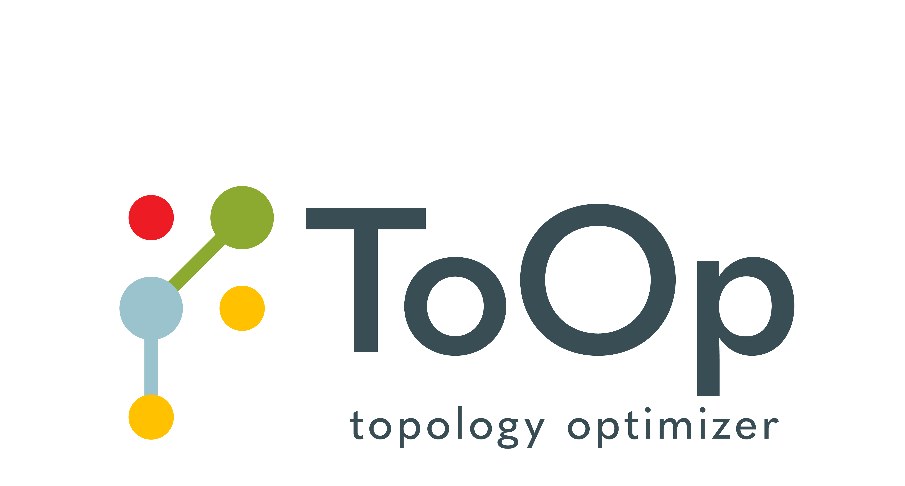
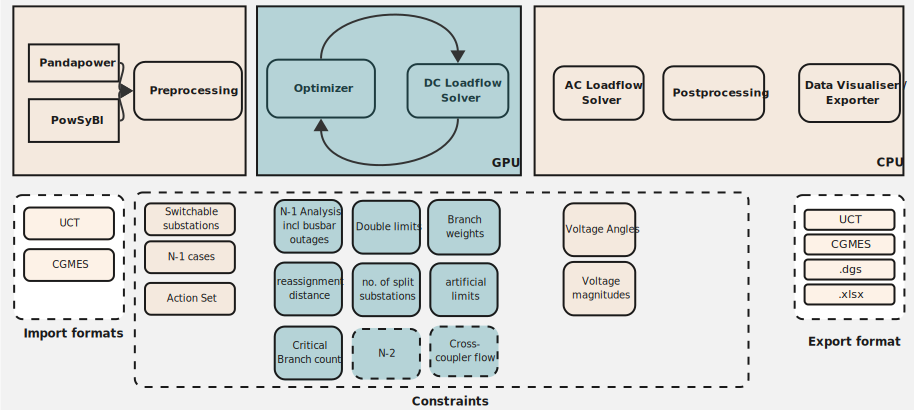

<!-- markdown-link-check-disable -->

[](https://github.com/eliagroup/ToOp/actions/workflows/ci.yaml)


[](https://sonarqube.consumercentricity.io/dashboard?id=gras-gridanalysis-toop-engine)
[](https://sonarqube.consumercentricity.io/dashboard?id=gras-gridanalysis-toop-engine)
[](https://sonarqube.consumercentricity.io/dashboard?id=gras-gridanalysis-toop-engine)

word
another word
<<<<<<< HEAD
yet another word
=======
>>>>>>> origin/debug

[](https://opensource.org/licenses/MPL-2.0)
[](https://www.python.org/downloads/release/python-3110/)
<!-- markdown-link-check-enable -->

## Hello you 👋

Welcome to our ToOp (engine) repository at Elia Group.




## A short intro - what is ToOp about?
ToOp is short for Topology Optimization and describes the approach to reduce grid congestion by topological actions. Topological actions are non-costly actions that can be applied to the grid to "steer" the electricity flow.   
ToOp is short for Topology Optimization and describes the approach to reduce grid congestion by topological actions. Topological actions are non-costly actions that can be applied to the grid to "steer" the electrcitiy flow.   
 Our goal is to propose (potentially) new topology strategies to the operators with the goal to lower redispatch costs and carbon emissions.  

This repository builds the engine behind the topology optimization product ToOp at Elia Group. ToOp provides tools to perform topology optimization on a grid file including import, DC optimization and AC validation. It also includes the gpu-based DC load flow solver.  At the current stage it considers transmission line switching, busbar splitting and busbar reassignments.


## About this repository
This repo builds the engine behind the topology optimization project ToOp at Elia Group. This provides a tool to perform topology optimization on a grid file including import, DC optimization and AC validation. Note that this does NOT provide a GUI or system integration code, you are expected to interact with the module through either python or kafka commands. You can check the [paper](https://arxiv.org/abs/2501.17529) for a high level academic introduction.
Please check out our [full documentation](https://eliagroup.github.io/ToOp).


## Getting Started

If you want to get started with the engine, we highly recommend checking out our [example notebooks](./notebooks).

### Prerequisites

If you want to contribute to this repository, we recommend using VS Code's Devcontainer Environment. This allows the developers to use the same environment to develop in.

For this setup, you need to install:
1. `uv`
2. `Microsoft VS Code`
3. `Docker`

### Installation

You can follow our installation guide on our [Contributing page](./CONTRIBUTING.md#local-development-setup).

### Usage

In order to understand the functionalities of this repo, please have a look at our examples in `notebooks/`.
There you can find several Jupyter notebooks that explain how to use the engine.
For example, you can load a grid file and compute the DC loadflow using our GPU-based loadflow solver.
Or you can load an example grid and minimise the branch overload by running the topology optimizer.

You can also build the documentation and open it on your web browser by running
```bash
uv sync --all-groups
uv run mkdocs serve
```

---


### Useful resources 
The following resources may be helpful to grasp the key concepts:

- [Quickstart](./docs/quickstart.md): Grasp the basics and follow along examples. The first one take you through a DC loadflow computation using the [DC Solver package](./docs/dc_solver/intro.md).
- [Usage](./docs/usage.md): Learn about the two different ways to use this software, either via python or kafka.
- [Topology Optimizer](./docs/topology_optimizer/intro.md): Understand the key concepts behind the topology optimizer.  
- [Presentation ToOp](https://www.youtube.com/watch?v=XteDpNsX75A)  @ LF Energy 2025
- [Presentation ToOp](https://lfenergy.org/lf-energy-summit-recap-and-video-a-gpu-native-approach-on-tackling-grid-topology-optimization/) @ LF Energy 2024

**Note**: This project does not provide a GUI or system integration code. 
You are expected to interact with the module through either python or kafka commands. This might come in the future if there is an interest from the community.

## High-level architecture


The topology optimizer takes as an input operational grid files (e.g. UCT, CGMES) which are imported by open-source libraries (PowSyBl, pandapower) and pre-processed. The pre-processed files are then optimized in a gpu-native set-up (optimizer + gpu-based load flow solver). The optimal results are stored as a pareto-front, so a set of all solutions that are "Pareto optimal". This means that no other solution exists that improves at least one objective without worsening another one. These results are then validated and filtered using an AC power flow. In the end the results are displayed in a frontend where an end user can review and evaluate the proposed actions. The proposed topological actions can then be exported to other systems.


#### Description the GPU-based DC load Flow solver
The GPU-based DC Load Flow solver serves the purpose of computing a large number of similar DC load flows in an
accelerated fashion. Currently the solver supports the following batch dimensions, i.e. the workload must not change
in anything other than these dimensions:
• Branch topology (assignment of branches to busbar A or B)
• Injection topology (assignment of injections to busbar A or B)
• Branch outages

Under the hood, it is using PTDF/(G)LODF/BSDF approaches to achieve this.


## Roadmap

Next to some smaller improvements, we currently plan to integrate PST into the optimization loop until Q2. We will work on sharing a more high-level roadmap in the future.


## Let us work together

We strongly believe that through joint development,  collaboration and integration into other tools, we can jointly build an open-source topology optimizer that is fast, provides accurate recommendations and can be used by different TSOs to reduce grid congestion. Topology optimization works best when holistically applied to the grid and the different operational constraints from different TSOs are considered. This is why we invite you to share your feedback, constraints and your approaches so that we can jointly improve ToOp.

In addition, we also see the opportunity that ToOp can be combined with other open-source tools. If you have ideas, reach out to us.
In addition, we also see the opportunity that ToOp can be combined with other open-source tools. If you have ideas, reach out to us.
We invite you to test it, ask questions and provide feedback to us. And if you like it, we invite you to contribute to the development. We are looking forward to hearing from you.

## Finding help

If you require help with using this package, your first point of contact is <a href="mailto:ToOp@eliagroup.eu">ToOp@eliagroup.eu</a>.


## Contributing

Please have a look at our [CONTRIBUTING.md](CONTRIBUTING.md).

---

## License

Distributed under MPL 2.0. See [LICENSE](./LICENSE).

## Citation

If you use our work in scientific research, please cite [our paper on load flow solving](https://arxiv.org/abs/2501.17529) and soon also the work on the optimizer architecture, which is to be released soon.

---

## Contact


Team – [ToOp](mailto:ToOp@eliagroup.eu)

---

## Acknowledgments

We credit the authors of JAX.
```
@software{jax2018github,
  author = {James Bradbury and Roy Frostig and Peter Hawkins and Matthew James Johnson and Chris Leary and Dougal Maclaurin and George Necula and Adam Paszke and Jake Vander{P}las and Skye Wanderman-{M}ilne and Qiao Zhang},
  title = {{JAX}: composable transformations of {P}ython+{N}um{P}y programs},
  url = {http://github.com/jax-ml/jax},
  version = {0.3.13},
  year = {2018},
}
```
