# Cascade Simulation

After each converged contingency load flow, an optional cascade simulation can be
enabled via `CascadeConfig`.
It models how a single outage can trigger a chain of further trips through distance
protection or current overload.

## How it works

Each call to `run_single_outage` follows this pipeline:

```mermaid
flowchart TD
    INPUT(["⚡ run_single_outage<br/>─────────────────<br/>net · contingency · ctx"])

    subgraph PF["① INITIAL POWER FLOW"]
        direction LR
        OUTAGE["Disconnect<br/>Outaged Elements"]
        SPPS["SpPS<br/>Iteration"]
        LF["pandapower<br/>runpp"]
        OUTAGE --> SPPS --> LF
    end

    subgraph RESULTS["② COLLECT RESULTS"]
        direction LR
        BR["Branch Results<br/>loading · power · per-side"]
        NR["Node Results<br/>voltages"]
        SR["Switch Results<br/>relay-side oriented"]
        RR["Regulating<br/>Element Results"]

        BR ~~~ NR
        NR ~~~ SR
        SR ~~~ RR
    end

    subgraph META["③ METADATA TABLES"]
        direction LR
        SPPSRES["SpPS Results<br/>schemes · iterations"]
        CONV["Convergence<br/>converged / failed"]

        SPPSRES ~~~ CONV
    end

    subgraph CASCADE["④ CASCADE SIMULATION ── NEW"]
        direction TB

        GUARD{"Load flow<br/>converged?<br/>+<br/>CascadeConfig<br/>present?"}

        subgraph CTX["Build Context"]
            BCTX["Relay data<br/>+ Network topology<br/>+ Breaker map"]
        end

        subgraph DETECT["Detect Triggers"]
            DT["Distance Protection<br/>Impedance vs. polygon zones<br/>⚠ WARNING 🔴 DANGER"]
            OL["Current Overload<br/>loading% vs. threshold"]
        end

        EMPTY(["∅ No cascade"])

        subgraph LOOP["Cascade Loop ── up to depth_limit steps"]
            direction TB

            L1["Map triggers → Outage Groups<br/>topology · connected components"]
            L2["Generate CascadeEvents<br/>element · reason · loading · impedance"]
            L3["Re-run SpPS + Load Flow<br/>(accumulated outages)"]
            L4["Attach SpPS activation info"]
            L5{"More<br/>triggers?"}
            L6{"Load flow<br/>converged?"}
            FAIL(["Failure Event<br/>→ stop"])

            L1 --> L2 --> L3 --> L4 --> L5
            L5 -->|yes| L6
            L6 -->|no| FAIL
            L6 -->|yes| L1
        end

        TABLE["Build Cascade Results"]

        GUARD -->|no| EMPTY
        GUARD -->|yes| CTX
        CTX --> DETECT
        DETECT -->|no triggers| EMPTY
        DETECT -->|triggers found| L1
        L5 -->|no| TABLE
        FAIL --> TABLE
        EMPTY --> TABLE
    end

    OUTPUT(["📦 Build LoadflowResults"])

    INPUT --> PF
    PF --> RESULTS
    RESULTS --> META
    META --> CASCADE
    CASCADE --> OUTPUT

    style INPUT fill:#dcfce7,stroke:#10b981,color:#064e3b
    style OUTPUT fill:#ede9fe,stroke:#7c3aed,color:#1e1b4b

    style PF fill:#ecfdf5,stroke:#10b981,color:#064e3b
    style RESULTS fill:#ecfdf5,stroke:#10b981,color:#064e3b
    style META fill:#f3f4f6,stroke:#6b7280,color:#374151

    style CASCADE fill:#f8fafc,stroke:#7c3aed,color:#0f172a
    style CTX fill:#f3f4f6,stroke:#6b7280,color:#374151
    style DETECT fill:#fffbeb,stroke:#f59e0b,color:#92400e
    style LOOP fill:#eff6ff,stroke:#3b82f6,color:#1e3a5f

    style EMPTY fill:#f3f4f6,stroke:#6b7280,color:#374151
    style FAIL fill:#fee2e2,stroke:#ef4444,color:#7f1d1d
    style TABLE fill:#dbeafe,stroke:#3b82f6,color:#1e3a5f

    style GUARD fill:#fef3c7,stroke:#f59e0b,color:#92400e
    style L5 fill:#fef3c7,stroke:#f59e0b,color:#92400e
    style L6 fill:#fee2e2,stroke:#ef4444,color:#7f1d1d
```



## Trigger types

| Type | Detection | Threshold |
|---|---|---|
| **Current overload** | Branch loading exceeds `current_loading_threshold` | Configurable per `CascadeConfig` |
| **Distance protection** | Relay impedance falls inside warning or danger polygon zone | Defined per relay in `sw_characteristics` |

## Configuration

Cascade screening is opt-in. Pass a `CascadeConfig` instance when building the
analysis context:

```python
from toop_engine_contingency_analysis.pandapower.cascade import CascadeConfig

cascade_cfg = CascadeConfig(
    depth_limit=5,
    current_loading_threshold=1.0,
    min_island_size=10,
    basecase_distance_protection_factor=0.9,
    contingency_distance_protection_factor=0.95,  # falls back to basecase factor if None
    cascade_log_elements=["line", "trafo", "trafo3w"],
)
```

When `cascade` is `None` in the context, the cascade step is skipped and
`LoadflowResults.cascade_results` is an empty DataFrame.

## Required network input: `net.sw_characteristics`

Distance protection requires a `sw_characteristics` table attached to the pandapower
network. Each row describes the protection settings of one relay. The table is linked
to `net.switch` via `net.switch["origin_id"]` → `sw_characteristics["breaker_uuid"]`.

| Column | Type | Description |
|---|---|---|
| `breaker_uuid` | `str` | Unique ID of the relay; matched against `net.switch["origin_id"]` |
| `relay_side` | `str` | Side of the switch the relay measures from: `"bus"` or `"element"` |
| `angle` | `float` | Opening angle of the protection zone polygon (degrees) |
| `r_i` | `float` | Inner resistance reach of the danger zone (Ω) |
| `r_v` | `float` | Outer resistance reach of the danger zone (Ω) |
| `x_v` | `float` | Outer reactance reach of the danger zone (Ω) |
| `custom_warning_distance_protection` | `float` | Per-relay warning zone scale factor; overrides the global `CascadeConfig` factors when set |

Example:

```python
import pandas as pd

net.sw_characteristics = pd.DataFrame([
    {
        "breaker_uuid": "relay-uuid-1",
        "relay_side": "bus",
        "angle": 80.0,       # degrees
        "r_i": 2.5,          # Ω
        "r_v": 10.0,         # Ω
        "x_v": 15.0,         # Ω
        "custom_warning_distance_protection": 0.9,
    },
])

# net.switch must have an "origin_id" column linking each switch to its relay
net.switch["origin_id"] = "relay-uuid-1"
```

If `sw_characteristics` is absent or empty, distance protection triggers are skipped
and only current overload is checked.

## Output

Cascade events are stored in `LoadflowResults.cascade_results`. Each row describes one element trip at one cascade step.

**Index columns** (uniquely identify each row):

| Column | Description |
|---|---|
| `timestep` | Timestep of the contingency calculation |
| `contingency` | Unique ID of the contingency that started the cascade |
| `cascade_number` | Cascade step number (1 = first trip after the initial outage, 2 = next, …) |
| `element_mrid` | External identifier of the tripped element |

**Data columns**:

| Column | Description |
|---|---|
| `element_id` | Internal unique ID of the tripped element |
| `element_name` | Human-readable name of the tripped element |
| `element_outage_group_id` | ID of the outage group the tripped element belongs to |
| `contingency_name` | Human-readable name of the originating contingency |
| `contingency_outage_id` | Outage group ID of the originating contingency |
| `cascade_reason` | Why the element tripped: `CURRENT_OVERLOAD` or `DISTANCE_PROTECTION` |
| `loading` | Branch loading value that caused the trip (current overload events) |
| `r_ohm` | Relay resistance measurement at trip time (distance protection events) |
| `x_ohm` | Relay reactance measurement at trip time (distance protection events) |
| `distance_protection_severity` | How deep into the protection zone: `WARNING` or `DANGER` (distance protection events) |
| `activated_schemes_per_iter` | SpPS schemes that activated during this cascade step (JSON string) |
