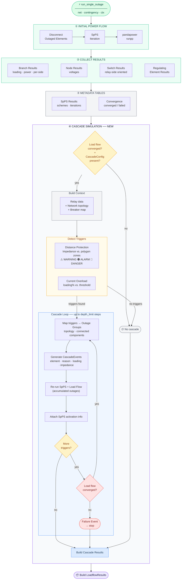

# Cascade Simulation

After each converged contingency load flow, an optional cascade simulation can be
enabled via `CascadeConfig`.
It models how a single outage can trigger a chain of further trips through distance
protection or current overload.

## How it works

Each call to `run_single_outage` follows this pipeline:


```mermaid
flowchart TD
    INPUT(["⚡ run_single_outage<br/>─────────────────<br/>net · contingency · ctx"])

    subgraph PF["① INITIAL POWER FLOW"]
        direction LR
        OUTAGE["Disconnect<br/>Outaged Elements"]
        SPPS["SpPS<br/>Iteration"]
        LF["pandapower<br/>runpp"]
        OUTAGE --> SPPS --> LF
    end

    subgraph RESULTS["② COLLECT RESULTS"]
        direction LR
        BR["Branch Results<br/>loading · power · per-side"]
        NR["Node Results<br/>voltages"]
        SR["Switch Results<br/>relay-side oriented"]
        RR["Regulating<br/>Element Results"]

        BR ~~~ NR
        NR ~~~ SR
        SR ~~~ RR
    end

    subgraph META["③ METADATA TABLES"]
        direction LR
        SPPSRES["SpPS Results<br/>schemes · iterations"]
        CONV["Convergence<br/>converged / failed"]

        SPPSRES ~~~ CONV
    end

    subgraph CASCADE["④ CASCADE SIMULATION ── NEW"]
        direction TB

        GUARD{"Load flow<br/>converged?<br/>+<br/>CascadeConfig<br/>present?"}

        subgraph CTX["Build Context"]
            BCTX["Relay data<br/>+ Network topology<br/>+ Breaker map"]
        end

        subgraph DETECT["Detect Triggers"]
            DT["Distance Protection<br/>Impedance vs. polygon zones<br/>⚠ WARNING 🟠 ALARM 🔴 DANGER"]
            OL["Current Overload<br/>loading% vs. threshold"]
        end

        EMPTY(["∅ No cascade"])

        subgraph LOOP["Cascade Loop ── up to depth_limit steps"]
            direction TB

            L1["Map triggers → Outage Groups<br/>topology · connected components"]
            L2["Generate CascadeEvents<br/>element · reason · loading · impedance"]
            L3["Re-run SpPS + Load Flow<br/>(accumulated outages)"]
            L4["Attach SpPS activation info"]
            L5{"More<br/>triggers?"}
            L6{"Load flow<br/>converged?"}
            FAIL(["Failure Event<br/>→ stop"])

            L1 --> L2 --> L3 --> L4 --> L5
            L5 -->|yes| L6
            L6 -->|no| FAIL
            L6 -->|yes| L1
        end

        TABLE["Build Cascade Results"]

        GUARD -->|no| EMPTY
        GUARD -->|yes| CTX
        CTX --> DETECT
        DETECT -->|no triggers| EMPTY
        DETECT -->|triggers found| L1
        L5 -->|no| TABLE
        FAIL --> TABLE
        EMPTY --> TABLE
    end

    OUTPUT(["📦 Build LoadflowResults"])

    INPUT --> PF
    PF --> RESULTS
    RESULTS --> META
    META --> CASCADE
    CASCADE --> OUTPUT

    style INPUT fill:#dcfce7,stroke:#10b981,color:#064e3b
    style OUTPUT fill:#ede9fe,stroke:#7c3aed,color:#1e1b4b

    style PF fill:#ecfdf5,stroke:#10b981,color:#064e3b
    style RESULTS fill:#ecfdf5,stroke:#10b981,color:#064e3b
    style META fill:#f3f4f6,stroke:#6b7280,color:#374151

    style CASCADE fill:#f8fafc,stroke:#7c3aed,color:#0f172a
    style CTX fill:#f3f4f6,stroke:#6b7280,color:#374151
    style DETECT fill:#fffbeb,stroke:#f59e0b,color:#92400e
    style LOOP fill:#eff6ff,stroke:#3b82f6,color:#1e3a5f

    style EMPTY fill:#f3f4f6,stroke:#6b7280,color:#374151
    style FAIL fill:#fee2e2,stroke:#ef4444,color:#7f1d1d
    style TABLE fill:#dbeafe,stroke:#3b82f6,color:#1e3a5f

    style GUARD fill:#fef3c7,stroke:#f59e0b,color:#92400e
    style L5 fill:#fef3c7,stroke:#f59e0b,color:#92400e
    style L6 fill:#fee2e2,stroke:#ef4444,color:#7f1d1d
```

## Trigger types

| Type | Detection | Threshold |
|---|---|---|
| **Current overload** | Branch loading exceeds the threshold resolved for its element type and case | Configurable per `CascadeConfig` |
| **Distance protection** | Relay impedance falls inside any of the three polygon zones | Defined per relay in `sw_characteristics` |

### Current overload thresholds

`loading` is the per-unit ratio `i / i_max`, so `1.5` means 150 %. The comparison is
strict: a branch loaded at exactly its threshold does **not** trip.

Each branch result row gets its own threshold, resolved from the element type
(`line`, transformer, or anything else) and from whether the row belongs to the base
case or to a contingency:

These live on `CascadeConfig.overload`, an `OverloadConfig`:

| Row | Threshold | Falls back to |
|---|---|---|
| `line`, base case | `overload.basecase_line` | `overload.current_loading_threshold` |
| `line`, contingency | `overload.contingency_line` | `overload.basecase_line`, then `overload.current_loading_threshold` |
| `trafo` / `trafo3w`, base case | `overload.basecase_transformer` | `overload.current_loading_threshold` |
| `trafo` / `trafo3w`, contingency | `overload.contingency_transformer` | `overload.basecase_transformer`, then `overload.current_loading_threshold` |
| any other table (e.g. `impedance`) | `overload.current_loading_threshold` | — |

All four overrides are optional. When none of them are set, every branch is compared
against `current_loading_threshold`, exactly as before they existed.

Unlike the distance-protection factors, these keep their fallback chain: the scalar
`current_loading_threshold` is the value every row uses until a more specific one is set.

## Base-case screening

A base case that already violates makes every contingency cascade meaningless: the cascade
would start from an already-broken state, and practically every contingency would report one.

Before any contingency is computed, the solved N-0 network is therefore screened once with the
same overload and distance-protection detection the simulator uses. Any of the three zones
counts as a violation — each means the relay is already reading into its
protection characteristic in N-0.

When the base case violates:

- cascade simulation is skipped for **every** contingency;
- the violation is reported instead, as `cascade_results` rows under the `BASECASE`
  contingency with `cascade_number = 0`. They carry the ordinary `CURRENT_VIOLATION` /
  `DISTANCE_PROTECTION` reasons — the step number is what sets them apart, since simulated
  cascade events always start at step 1;
- a warning is added to `LoadflowResults.warnings`;
- the N-1 load flows themselves are **unaffected** — branch, node, switch and va-diff results
  are computed exactly as usual.

Screening is controlled by `stop_cascade_on_basecase_violation` (default `True`). Set it to
`False` to restore the previous behaviour and simulate the cascade even from a violating base
case — for example in tests that deliberately overload the base case to force a cascade.

The screen is skipped when the base-case load flow did not converge: its `res_*` tables are
stale, so there is nothing meaningful to check.

## Configuration

Cascade screening is opt-in. Pass a `CascadeConfig` instance when building the
analysis context:

```python
from toop_engine_contingency_analysis.pandapower.cascade.configuration import (
    CascadeConfig,
    DistanceProtectionConfig,
    DistanceProtectionFactors,
    OverloadConfig,
)

cascade_cfg = CascadeConfig(
    depth_limit=5,
    min_island_size=10,
    overload=OverloadConfig(current_loading_threshold=1.0),
    distance_protection=DistanceProtectionConfig(
        alarm=DistanceProtectionFactors(
                basecase_line=1.0,
            basecase_transformer=1.0,
            basecase_bus_coupler=1.0,
            contingency_line=1.0,
            contingency_transformer=1.0,
            contingency_bus_coupler=1.0,
        ),
        warning=DistanceProtectionFactors(
                basecase_line=1.41,
            basecase_transformer=1.41,
            basecase_bus_coupler=1.41,
            contingency_line=1.41,
            contingency_transformer=1.41,
            contingency_bus_coupler=1.41,
        ),
    ),
    cascade_log_elements=["line", "trafo", "trafo3w"],
    stop_cascade_on_basecase_violation=True,  # skip the cascade when N-0 already violates
)
```

To trip lines at 150 % and transformers at 180 % instead, add the per-type overrides
(see [Current overload thresholds](#current-overload-thresholds)):

```python
cascade_cfg = CascadeConfig(
    depth_limit=5,
    min_island_size=10,
    overload=OverloadConfig(
        current_loading_threshold=1.0,  # still used for e.g. impedances
        basecase_line=1.5,
        basecase_transformer=1.8,
    ),
    distance_protection=DistanceProtectionConfig(
        alarm=DistanceProtectionFactors(
                basecase_line=1.0,
            basecase_transformer=1.0,
            basecase_bus_coupler=1.0,
            contingency_line=1.0,
            contingency_transformer=1.0,
            contingency_bus_coupler=1.0,
        ),
        warning=DistanceProtectionFactors(
                basecase_line=1.41,
            basecase_transformer=1.41,
            basecase_bus_coupler=1.41,
            contingency_line=1.41,
            contingency_transformer=1.41,
            contingency_bus_coupler=1.41,
        ),
    ),
    cascade_log_elements=["line", "trafo", "trafo3w"],
)
```

### Distance protection factors

A factor divides the relay impedance measurement before the polygon test
(`x = |r_ohm| / factor`), so a larger factor moves the measured point toward the origin
and **widens** the effective area. `1.0` leaves the relay polygon exactly as the relay
defines it.

### The three zones

A measurement falls into one of three nested zones. `DistanceProtectionSeverity` names them,
innermost first:

| Zone | What it is | Configurable |
|---|---|---|
| `DANGER` | The relay polygon exactly as the relay defines it — the real trip boundary | **No.** No factor may widen it |
| `ALARM` | The ring just outside the danger polygon | `distance_protection.alarm` |
| `WARNING` | The outermost ring | `distance_protection.warning` |

They nest — danger inside alarm inside warning — which in factor terms means
`1.0 <= alarm <= warning` on each axis. Nothing enforces that: a narrower warning area still
works, because a relay inside its raw polygon trips on the danger zone regardless.

A relay trips when it is inside **any** zone; the severity recorded on the event is the
innermost zone it reached. So the warning factors are normally what decide *which* relays
trip, while the alarm factors only move the `ALARM`/`WARNING` labelling boundary.

`DistanceProtectionConfig` holds one `DistanceProtectionFactors` group per configurable zone,
and each group carries every case/element combination:

| | `line` | `transformer` | `bus_coupler` |
|---|---|---|---|
| **base case** | `basecase_line` | `basecase_transformer` | `basecase_bus_coupler` |
| **contingency** | `contingency_line` | `contingency_transformer` | `contingency_bus_coupler` |

Six per zone, so **twelve in total, all required** — none has a default and none falls back to
another. A configuration therefore always states the factor it wants on every axis, and a
caller written against an older release fails at construction instead of silently picking up
a default.

!!! note "The trip boundary is not configurable"
    The danger zone is the relay polygon untouched, so no setting here can make the
    simulation report a trip inside a boundary the physical relay would not cross. Only the
    two outer screening rings take factors.

A relay whose `protection_element` is `None` — its protected side carries no single element
type — takes **the largest of the three factors**, so an ambiguous relay is screened at least
as widely as any candidate would screen it.

When `cascade` is `None` in the context, the cascade step is skipped and
`LoadflowResults.cascade_results` is an empty DataFrame.

## Required network input: `net.sw_characteristics`

Distance protection requires a `sw_characteristics` table attached to the pandapower
network. Each row describes the protection settings of one relay. The table is linked
to `net.switch` via `net.switch["origin_id"]` → `sw_characteristics["breaker_uuid"]`.

| Column | Type | Description |
|---|---|---|
| `breaker_uuid` | `str` | Unique ID of the relay; matched against `net.switch["origin_id"]` |
| `relay_side` | `str` | Side of the switch the relay measures from: `"bus"` or `"element"` |
| `protection_side` | `str` | Side the relay protects, and so the side isolated when it opens: `"bus"` or `"element"` |
| `angle` | `float` | Opening angle of the protection zone polygon (degrees) |
| `r_i` | `float` | Inner resistance reach of the danger zone (Ω) |
| `r_v` | `float` | Outer resistance reach of the danger zone (Ω) |
| `x_v` | `float` | Outer reactance reach of the danger zone (Ω) |
| `protection_element` | `str` or `None` | Which element the relay protects: `"line"`, `"trafo"`, `"bus_coupler"`, or `None` when the protected side carries no single type |
| `custom_base_alarm` | `float` | Per-relay alarm factor for the base case; `NaN` falls back to the global factor |
| `custom_base_warning` | `float` | Per-relay warning factor for the base case; `NaN` falls back to the global factor |
| `custom_contingency_alarm` | `float` | Per-relay alarm factor after a contingency; `NaN` falls back to the global factor |
| `custom_contingency_warning` | `float` | Per-relay warning factor after a contingency; `NaN` falls back to the global factor |

Example:

```python
import pandas as pd

net.sw_characteristics = pd.DataFrame([
    {
        "breaker_uuid": "relay-uuid-1",
        "relay_side": "bus",
        "protection_side": "element",
        "angle": 80.0,       # degrees
        "r_i": 2.5,          # Ω
        "r_v": 10.0,         # Ω
        "x_v": 15.0,         # Ω
        "protection_element": "line",
        "custom_base_alarm": float("nan"),      # no override -> global alarm factor
        "custom_base_warning": 0.9,
        "custom_contingency_alarm": float("nan"),
        "custom_contingency_warning": 0.9,
    },
])

# net.switch must have an "origin_id" column linking each switch to its relay
net.switch["origin_id"] = "relay-uuid-1"
```

If `sw_characteristics` is absent or empty, distance protection triggers are skipped
and only current overload is checked.

## Output

Cascade events are stored in `LoadflowResults.cascade_results`. Each row describes one element trip at one cascade step.

**Index columns** (uniquely identify each row):

| Column | Description |
|---|---|
| `timestep` | Timestep of the contingency calculation |
| `contingency` | Unique ID of the contingency that started the cascade |
| `cascade_number` | Cascade step number (0 = pre-existing base-case violation, 1 = first trip after the initial outage, 2 = next, …) |
| `element_mrid` | External identifier of the tripped element |

**Data columns**:

| Column | Description |
|---|---|
| `element_id` | Internal unique ID of the tripped element |
| `element_name` | Human-readable name of the tripped element |
| `element_outage_group_id` | ID of the outage group the tripped element belongs to |
| `contingency_name` | Human-readable name of the originating contingency |
| `contingency_outage_id` | Outage group ID of the originating contingency |
| `cascade_reason` | Why the element tripped: `CURRENT_VIOLATION`, `DISTANCE_PROTECTION` or `FAILED_LF` |
| `loading` | Branch loading value that caused the trip (current overload events) |
| `r_ohm` | Relay resistance measurement at trip time (distance protection events) |
| `x_ohm` | Relay reactance measurement at trip time (distance protection events) |
| `distance_protection_severity` | Innermost zone reached: `DANGER`, `ALARM` or `WARNING` (distance protection events) |
| `activated_schemes_per_iter` | SpPS schemes that activated during this cascade step (JSON string) |

### Base-case violation rows

When [base-case screening](#base-case-screening) trips, `cascade_results` holds only the
base-case report. Those rows differ from simulated cascade events:

| Column | Value |
|---|---|
| `cascade_number` | `0` — found before the first cascade step runs. This is what identifies a base-case row: simulated events always start at 1 |
| `contingency`, `contingency_name`, `contingency_outage_id` | `BASECASE` — the violation belongs to N-0, not to any contingency |
| `cascade_reason` | The ordinary `CURRENT_VIOLATION` / `DISTANCE_PROTECTION` reasons |
| `element_outage_group_id` | `None` — nothing is simulated, so no outage group is computed |
| `loading` | Base-case loading, on the most heavily loaded side of the element |
| `r_ohm`, `x_ohm`, `distance_protection_severity` | Base-case relay measurement, as for a simulated relay trip |

To find them:

```python
cascade_results.filter(pl.col("cascade_number") == 0)
```
