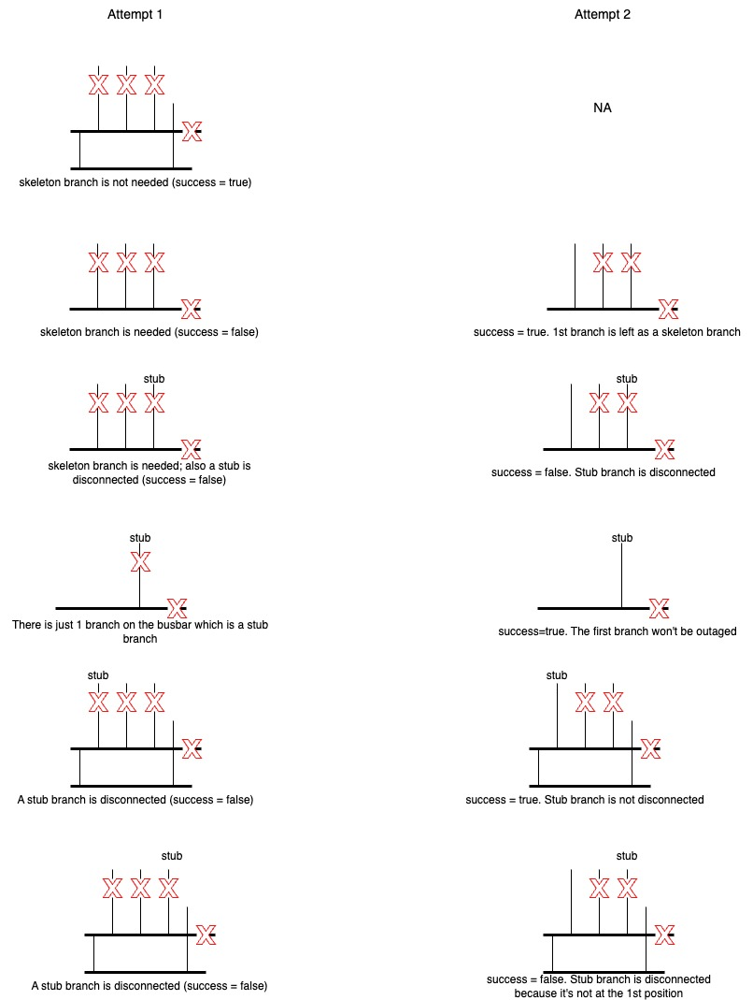

# Busbar Outage

A busbar outage is implemented by outaging the connected branches and injections corresponding to the busbar while ensuring that the grid remains unsplit. Busbar outage is accomplished in two steps:
1. Preprocessing: Extract and calculate data needed for step 2. This data includes the branches and injections that will have to be outaged if a busbar is outaged.
2. Perform Outage: Calculate loadflows due to the outage of the busbars. This involves outaging the connected branches and injections to the busbar being outaged.
## 1. Preprocess

In this step, we calculate the branches to be outaged as well as injections to be deducted for non-relevant and relevant busbar outages. We have different preprocessing routines for outaging busbars of relevant and non-relevant substations.

### Preprocess non-relevent busbar outage:

We model the busbar-outage as a multi-outage problem of lines and injections. For each busbar, get all the branches and sum up the injections connected to it. If we outage this busbar, then all these branches will be outaged using MODF formulation, and the sum of injections (delta_p) will be subtracted from the nodal injection at the node.

However, if there is a stub branch connected to the station we can't delete this branch. A stub branch is essentially a bridge branch, the outage of which would lead to splitting the grid into two. If the busbar has a stub branch, we don't delete this branch. Additionally, we sum up all the injections along the stub branch and subtract this along with injection directly connected to the busbar.


### Preprocess relevent busbar outage:

Handling relevant busbar outage is trickier than non-relevant busbars. Each branch action can change which lines are allocated to which busbar. Additionally, there is another important concept to understand: a electrical busbar can have multiple physical busbars.

In our project, we start with a configuration where all the busbars of the station are coupled, and we can split the station just once. This means a station splits into two electrical busbars: busbar_A and busbar_B. An electrical busbar can comprise multiple physical busbars. Let's go through the following example to understand this better.

Imagine a station 'X' has 4 physical busbars - 'bb0', 'bb1', 'bb2', 'bb3' with 5 lines - 'l0', 'l1', 'l2', 'l3', 'l4' - and 2 injections - 'inj0', 'inj1'.
Following is how the different assets (branches and injections) are connected to station 'X':
bb0 = ['l0', 'l4']
bb1 = ['l1', 'inj0']
bb2 = ['l2', 'inj1']
bb3 = ['l3']

If station 'X' is split, it can split into (2^3 - 1) possible busbar configurations. A configuration defines which physical busbars are mapped to busbar_A and busbar_B. Let's assume that a branch action 'a1' = [0,0,1,0,1] is performed on station 'X', and it splits into the following busbar configuration:
busbar_A: ['bb0']
busbar_B: ['bb1', 'bb2', 'bb3']

Here the physical busbar 'bb0' is mapped to electrical busbar_A, and the rest of the physical busbars are mapped to busbar_B. Before the split, the station looked like the following electrically:
busbar_A: ['l0', 'l4']
busbar_B: ['l1', 'l2', 'l3', 'inj0', 'inj1']

After applying branch action 'a1', we get the following electrical topology for the station:
busbar_A: ['l0', 'l1', 'l3']
busbar_B: ['l2', 'l4', 'inj0', 'inj1']

This can translate into the following physical topology:
bb0 = ['l0', 'l1', 'l3']
bb1 = ['inj0']
bb2 = ['l2', 'inj1']
bb3 = ['l4']

Now, when we outage 'bb1' of station 'X', we need to outage 'inj0' from the nodal_index of busbar_B. Likewise, if we outage 'bb0', we need to outage all lines from the set {'l0', 'l1', 'l3'} except the lines which serve as stub branches. Similarly, if we take another action 'a2', the branches that will be outaged, the injections that will have to be outaged, and the nodal_index of the physical busbar will change. The nodal_index of the physical busbar changes because the branch action determines whether a particular physical busbar must be mapped to the electrical busbar_A or busbar_B, in other words, the configuration of the busbar. Therefore, we need to calculate for each action in the action set, the branches to be outaged, delta_p, and the nodal_index of the busbar.

Additionally, injection actions change the topology of the injections. However, at the moment, the feature to consider injection actions is not implemented yet in busbar_outage module.

## 2. Perform Outage

After the busbar_outage is modelled as a multi-outage problem of branches and injections, we implement the outage using the MODF formulation and calculate the loadflows in the montiored branches correponding to every busbar outaged.

A busbar outage happens in a two step process. In the first attempt we disconnect all the branches that we calculated in the preprocessing step for the busbar outage. If the busbar outage fails then we do a 2nd attempt but this time we disconnect all branches but the very first branch in the list of branches to be disconnected. The branch left connected serves as a skeleton branch.

Additionally, there are cases when busbar outages fail because of outage of stub branches. Recall that we already removed the stub branches from the list of branches to be outaged in the preprocessing step. However, in this case, these are the regular branches that turn into stub/bridge branches due to branch actions.

The following image provides a description of the algorithm followed for a single busbar outage along with different examples.


## Busbars serving as articulation nodes:

There are certain busbars in the station, the outage of which can split the grid into two. For example, if the busbars are connected as a daisy chain in the substation, like shown here: bb1 - bb2 - bb3. In this case, if we outage bb2, the station will be split. Therefore, we abstain from calculating busbar outage of such busbars.

## Busbar outage integration into optimiser

### Case 1: Elia - Treat busbar outage as N-1 case

Here, the busbar outages need to be treated like other N-1 cases as the objective is to solve busbar outage problems.

```python
# Enable busbar outage and treat bb_outages as N-1
solver_config.enable_bb_outage = True
solver_config.bb_outage_as_nminus1 = True
```

We calculate the loadflows due to different busbar outages, and concatenate it to the N-1 matrix.

### Case 2: 50 Hz - Treat busbar outage similar to N-2 case

```python
# Enable busbar outage and don't treat bb_outage as N-1
solver_config.enable_bb_outage = True
solver_config.bb_outage_as_nminus1 = False
```

In this case, we need to penalise the optimiser if the split leads to worsening of
busbar_outage case. This is done by comparing the worst case overload energy due to busbar outages before the split and after the split.

Note that in this case, we consider busbar outages of only relevant busbars.

## Future Work:
1. Implement test to compare busbar outage of rel_subs with powsybl
2. Implement support for injection action: The plan is to have exactly 1 injection action for each branch action. If we wish to have multiple injection actions for a single branch action, then we need to duplicate the branch action as many times as there are number of injection actions for the station.
