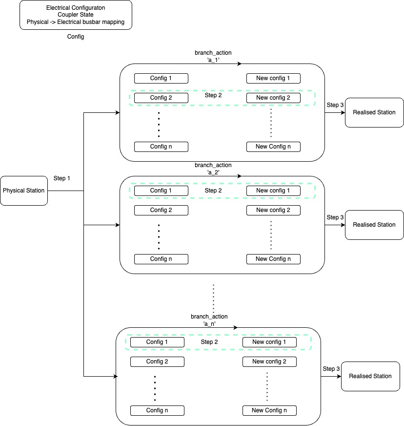

# Install_time Processing



At install time, for each branch_action in the BranchActionSet, there has to be a single physical topology that will be realized in the postprocessing. There can be multiple feasible realizations for a given branch_action, and therefore, the following filtering strategy can help converge to a single topology realization based on feasibility analysis and heuristics.

1. Generate all feasible configurations for a station. In a real grid, not all busbars can be connected to another busbar due to multiple reasons. For example, there can be a busbar coupler missing between two busbars. In this step, we determine out of 'n' physical busbars, which of the busbars will be grouped as busbar_a and which ones will be grouped as busbar_b.

Each configuration has three types of data associated with it:
* Electrical configuration of the assets connected to the station: For example, if there are 3 assets in the station (with 4 physical busbars), then one of the electrical configurations could be:
    ```
    [[1, 0, 0],
     [0, 1, 1]]
    ```
    Here, asset 1 is assigned to electrical busbar_A and the other two assets are assigned to electrical busbar_B.

* Coupler state: This stores information about the state of couplers in the station. For example, if there are three couplers in the station, then the state of couplers could be represented like [1, 0, 0].

* Busbar_A mapping: This represents the set of physical busbars that are mapped to the electrical busbar A. For example, the first 3 physical busbars of the station could be mapped to busbar_A while the 4th physical busbar could be busbar_B.

2. Choose the best starting configuration of the station. Each action in the action_set of the station would change the configuration of the station. The best configuration out of all initial configurations is the one that requires the least number of switchings to implement the branch action.

3. After applying the branch_action, we get the new electrical configuration only if the branch_action is feasible. If the branch_action is not feasible, then just delete the branch_action from the branch_action set. This electrical configuration needs to be realized to create the new station.

There can be multiple ways to realize the final electrical configuration of the station.
* Uniform distribution: Distribute assets uniformly across the busbars.
