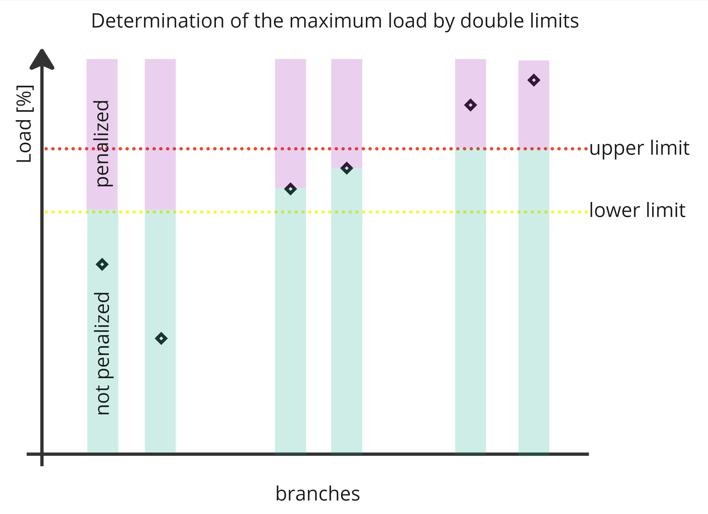

# Quickstart

## Preprocessing

To get the solver running, we first need to preprocess a grid file. In addition to the grid file, the backends usually expect some mask to define additional information that is not typically stored in a grid file, such as which branches to use in the N-1 computation. Consult the documentation of the backends for more information. There are three noteworthy steps in the preprocessing:
- **[`BackendInterface`][packages.interfaces_pkg.src.toop_engine_interfaces.backend.BackendInterface]**: A backend offers a read-only interface to a power systems modelling software and translates the information from the modelling software into a software-agnostic node-branch representation. Currently, there is a [`PandaPowerBackend`][packages.dc_solver_pkg.src.toop_engine_dc_solver.preprocess.pandapower.pandapower_backend.PandaPowerBackend] and a [`PowsyblBackend`][packages.dc_solver_pkg.src.toop_engine_dc_solver.preprocess.powsybl.powsybl_backend.PowsyblBackend] available.
- **[`NetworkData`][packages.dc_solver_pkg.src.toop_engine_dc_solver.preprocess.network_data.NetworkData]**: This is a backend-agnostic representation of the grid with all the information needed for post-processing and execution of the loadflow solver. You can obtain a filled instance of this through [`preprocess`][packages.dc_solver_pkg.src.toop_engine_dc_solver.preprocess.preprocess] and generate a [`StaticInformation`][packages.dc_solver_pkg.src.toop_engine_dc_solver.jax.types.StaticInformation] dataclass from it.
- **[`StaticInformation`][packages.dc_solver_pkg.src.toop_engine_dc_solver.jax.types.StaticInformation]**: Stores only the relevant data for the loadflow computation directly on GPU VRAM, fully in jax format. You can obtain this from a filled network data instance through [`convert_to_jax`][packages.dc_solver_pkg.src.toop_engine_dc_solver.preprocess.convert_to_jax].

A potential preprocessing invocation could look like this:

```python
from toop_engine_dc_solver.preprocess import (PandaPowerBackend, preprocess, convert_to_jax)
import jax

jax.config.update("jax_enable_x64", True)
backend = PandaPowerBackend("path_to_grid_files")
network_data = preprocess(backend)
static_information = convert_to_jax(network_data)
```

The `jax.config.update` statement is recommended because otherwise the static information will be in 32 bit, as jax is [automatically converting everything to 32 bit by default](https://jax.readthedocs.io/en/latest/notebooks/Common_Gotchas_in_JAX.html#double-64bit-precision) and setting this config flag will stop it from doing so. You can still switch to 32 bit during the execution, but by running the preprocessing in 64 bit, you will retain the option to choose at the expense of a bit of disk space.

After preprocessing, you can then save the data to load it later on the machine where you want to compute the loadflows:

```python
from toop_engine_dc_solver.preprocess import save_network_data
from toop_engine_dc_solver.jax import save_static_information

save_network_data("network_data.pkl", network_data)
save_static_information("static_information.hdf5", static_information)
```

And then later on the machine:

```python
from toop_engine_dc_solver.jax import load_static_information

static_information = load_static_information("static_information.hdf5")
```

## Running the solver

### Getting started

To get a simple N-0/N-1 computation, we can use [`run_solver`][packages.dc_solver_pkg.src.toop_engine_dc_solver.jax.run_solver]:

```python
from toop_engine_dc_solver.jax import (run_solver, default_topology, default_injection)

topology = default_topology(static_information)
injection = default_injection(static_information)

res = run_solver(topology, None, injection, static_information)
```

This will give us the [`SparseSolverOutput`][packages.dc_solver_pkg.src.toop_engine_dc_solver.jax.SparseSolverOutput] for all topologies, containing [`SparseNMinus0`][packages.dc_solver_pkg.src.toop_engine_dc_solver.jax.SparseNMinus0] and [`SparseNMinus1`][packages.dc_solver_pkg.src.toop_engine_dc_solver.jax.SparseNMinus1] results in sparse representation, only giving back the worst elements. 
For controlling the amount of results returned, you can adjust
[`number_most_affected`][packages.dc_solver_pkg.src.toop_engine_dc_solver.jax.types.SolverConfig], [`number_most_affected_n_0`][packages.dc_solver_pkg.src.toop_engine_dc_solver.jax.types.SolverConfig] and [`number_max_out_in_most_affected`][packages.dc_solver_pkg.src.toop_engine_dc_solver.jax.types.SolverConfig]:

```python
from jax_dataclasses import replace

static_information = replace(
    static_information,
    solver_config=replace(
        static_information.solver_config,
        number_most_affected=20,
        number_max_out_in_most_affected=5,
        number_most_affected_n_0=20,
    )
)
```

If you instead require the full N-1 matrix, you can pass a custom `aggregate_outputs_fn` to the solver. Note that for this, you will have to know whether you have a [`run_solver_symmetric`][packages.dc_solver_pkg.src.toop_engine_dc_solver.jax.run_solver_symmetric] or [`run_solver_inj_bruteforce`][packages.dc_solver_pkg.src.toop_engine_dc_solver.jax.run_solver_inj_bruteforce] batch. Both methods accept an `aggregate_output_fn` which follows the signature of [`AggregateOutputProtocol`][packages.dc_solver_pkg.src.toop_engine_dc_solver.jax.AggregateOutputProtocol]. Let's pass a simple aggregate output function that performs no aggregation at all and just passes through the N-0 and N-1 results:

```python
custom_aggregate_fn = lambda lf_res: (lf_res.n_0_matrix, lf_res.n_1_matrix)

(n_0_res, n_1_res), success = run_solver_symmetric(topology, None, injection, static_information, custom_aggregate_fn)
```

Note that if you want to call `run_solver_symmetric` in a loop, you should define the aggregate function outside of the loop as otherwise jax will recompile on every iteration.

### Adjusting topologies

Eventually, you will want to compute some changes on the grid.

For this, you need to familiarize yourself with the topo-vect format as introduced by grid2ops. The basic idea behind this is to set the assumption that an individual voltage-level/substation will only operate in 1-node-configuration or 2-node-configuration. I.e. even if there are more than 2 busbars in the substation, they will only form at most two separate connected components. Hence, we can represent the assignments of elements to the busbars as boolean vectors. Let's say we have a grid with 2 substations:

- SubA with 4 branches and 2 injections
- SubB with 5 branches and 1 injection.

The topo-vects for this grid would look like this:
```python
branch_topo_vect = [
    True, False, True, False,  # SubA
    True, False, True, False, True  # SubB
]

inj_topo_vect = [
    True, False,  # SubA
    True  # SubB
]
```
Hence, to know which entry in the topo-vect belongs to which branch in which substation, we simply have to enumerate all substations with all branches. We will call this format the *numpy* format, as it is used in the CPU code. In the jax code, we modify this slightly and instead have a padded array where the last elements will be ignored:

```python
branch_topo_vect = [
    [True, False, True, False, False],  # SubA, last element is ignored
    [True, False, True, False, True]  # SubB
]
```

You can use [`convert_topo_sel_sorted`][packages.dc_solver_pkg.src.toop_engine_dc_solver.jax.convert_topo_sel_sorted] and [`convert_branch_topo_vect`][packages.dc_solver_pkg.src.toop_engine_dc_solver.jax.convert_branch_topo_vect] to convert between the two formats of storing a branch topology.

Injection topologies are represented via the action set in JAX. For custom injection combinations you can use [`convert_inj_topo_vect`][packages.dc_solver_pkg.src.toop_engine_dc_solver.jax.convert_inj_topo_vect] together with [`convert_inj_candidates`][packages.dc_solver_pkg.src.toop_engine_dc_solver.jax.convert_inj_candidates] to build inputs for the solver.

### Influencing the Topology Evaluation

The optimizer requires at least one metric to steer improvement. By default this is the overload energy of all reward-branches, but other metrics can be used or added. To calculate these metrics, certain parameters must be defined or calculated during preprocessing.

#### Adjusting the physical branch limits

Real life operations may require an adjustment of the physical branch limits e.g. to reduce a line further due to uncertainties in the forecasts or to reduce a line less preventatively due to easy curative actions. In the German PRDx process, black and white lists are used for this purpose. The whitelist can be used to define different maximum load-values. The blacklist can be used to exclude branches from the n-1-calculation. This is currently happening in the importing step.

#### Metrics Overview

The possible aggregation metrics can be found [`here`][packages.interfaces_pkg.src.toop_engine_interfaces.types.MetricType]. Here is a brief summary:

| Metric                                    | Description                                                                                                                                                                |
|-------------------------------------------|----------------------------------------------------------------------------------------------------------------------------------------------------------------------------|
| "max_flow_n_0"                            | The maximum flow on all monitored branches in N0                                                                                                                           |
| "median_flow_n_0"                         | The median flow on all monitored branches in N0                                                                                                                            |
| "overload_energy_n_0"                     | The sum of the load above the physical load limit on all monitored branches in N0                                                                                          |
| "underload_energy_n_0"                    | The sum of the load between the current load and the physical load limit on all monitored branches in N0                                                                   |
| "overload_energy_limited_n_0"             | The sum of the load above the adjusted load limit [(see double limits)](#double-limits) on all monitored branches in N0                                                    |
| "exponential_overload_energy_n_0"         | The sum of the load above the physical load limit on all monitored branches in N0 multiplied with an exponentially increasing factor                                       |
| "exponential_overload_energy_limited_n_0" | The sum of the load above the adjusted load limit [(see double limits)](#double-limits) on all monitored branches in N0 multiplied with an exponentially increasing factor |
| "critical_branch_count_n_0"               | The amount of overloaded monitored branches according to their physical limit in N0                                                                                        |
| "critical_branch_count_limited_n_0"       | The amount of overloaded monitored branches according to their adjusted limit [(see double limits)](#double-limits) in N0                                                  |
| "max_flow_n_1"                            | The maximum flow on all monitored branches in N-1                                                                                                                          |
| "median_flow_n_1"                         | The median flow on all monitored branches in N-1                                                                                                                           |
| "overload_energy_n_1"                     | The sum of the load above the physical load limit on all monitored branches in their worst N-1 case                                                                        |
| "underload_energy_n_1"                    | The sum of the load between the worst N-1-Load and the physical load limit on all monitored branches                                                                       |
| "overload_energy_limited_n_1"             | The sum of the load above the adjusted load limit [(see double limits)](#double-limits) on all monitored branches in their worst N-1 case                                  |
| "exponential_overload_energy_n_1"         | The sum of the load above the physical load limit on all monitored branches in their worst N-1 case multiplied with an exponentially increasing factor                     |
| "exponential_overload_energy_limited_n_1" | The sum of the load above the adjusted load limit [(see double limits)](#double-limits) on all monitored branches in their worst N-1 case multiplied with an exponentially increasing factor |
| "critical_branch_count_n_1"               | The amount of overloaded monitored branches in their worst N-1-case assuming the physical load limits                                                                      |
| "critical_branch_count_limited_n_1"       | The amount of overloaded monitored branches in their worst N-1-case assuming the adjusted load limits [(see double limits)](#double-limits)                                |
| "n0_n1_delta"                             | [See N0/N1 Delta](#n0---n1-maximum-difference-factors)                                                                                                                     |
| "cross_coupler_flow"                      | The sum of the power flowing across the switched busbarcouplers before opening them                                                                                        |
| "switching_distance"                      | The amount of switching actions have to take place from the original to the proposed topology                                                                              |
| "split_subs"                              | The amount of busbar couplers were opened                                                                                                                          |

#### Branch Weights

Branch weights change the weighting of the individual branches for the calculation of the chosen overload metric.

$$
\text{overload}_\text{grid} = \sum_{branch=1}^n \text{weight}_\text{branch} * \text{overload}_{branch}
$$

Per default the weight of each branch is 1.0. The weight can be increased or decreased, which can be useful if

- some branches require a higher redispatch volume and/or more expensive plants per Watt of overload energy than others
- certain branches are more (or less) critical than others (e.g. cross border lines)

#### Double limits

Another option is to set two relative limits that define the maximum load of each branch depending on its current load. Branches whose load is below the lower limit may be loaded up to this limit. For all branches whose load is within the limits, the current load is set as the maximum load and the upper limit applies to all branches that are currently overloaded.

 {width=400}

The background to this is the operators' desire to avoid creating high utilization across the entire grid by shifting loads. The intended effect is that lower loaded branches don't become critical, highly loaded branches aren't getting worse and overloaded branches are reduced.

The limits are calculated as part of the initial load flow calculation ([`run_initial_loadflow`][packages.dc_solver_pkg.src.toop_engine_dc_solver.preprocess.convert_to_jax.run_initial_loadflow]) during the preprocess function [`load_grid`][packages.dc_solver_pkg.src.toop_engine_dc_solver.preprocess.convert_to_jax.load_grid] and stored inside the static information as part of the branch_limits with the keys `'max_mw_flow_limited'` and `'max_mw_flow_n_1_limited'` with a default lower limit of 0.9. To change this value pass the argument `lower_limit_n_0` or `lower_limit_n_1` to either of the functions.

To use the double limits in the optimizer, `"overload_energy_limited_n_1"` or `"overload_energy_limited_n_0"` has to be included in the target_metrics.

#### N0 - N1 Maximum Difference Factors

The N0 - N1 Max Diff Factors limit the increase of load on certain branches in the N-1 case. By applying this limit to transformers, the optimizer is penalized for creating scenarios that pump a lot of energy into the distribution grid upon simple failures.

 {width=800}

The limits can be set by providing `.npy` masks for each branch-type that shall be penalized: `{branch_type}_n0_n1_max_diff_factor.npy`
The array should include factors that are multiplied with the current N0 - N1 Difference to calculate the maximum non-penalized difference in MW after the optimization.
For example if a branch has a 20 MW diff between N-0 and N-1 in the base case (in the unsplit configuration) and the factor is 2, then the maximum allowed difference for the n0_n1_delta penalty would be 40 MW. If a negative factor is used, this branch has no N-0 to N-1 maximum delta and will always incur a penalty of 0.
The absolute values of the N0-N1 Difference are calculated as part of the initial load flow calculation ([`run_initial_loadflow`][packages.dc_solver_pkg.src.toop_engine_dc_solver.preprocess.convert_to_jax.run_initial_loadflow]) during the preprocess function [`load_grid`][packages.dc_solver_pkg.src.toop_engine_dc_solver.preprocess.convert_to_jax.load_grid] and stored inside the static information as part of the branch_limits with the key `'n0_n1_max_diff'`.

To use the N0-N1 Difference in the optimizer, the metric `"n0_n1_delta"` has to be included in the target_metrics.

### Postprocessing

The repository offers some postprocessing routines as well, they are bundled in the [`postprocess`][packages.dc_solver_pkg.src.toop_engine_dc_solver.postprocess] module. Depending on the backend you use, you will either need a [`PandapowerRunner`][packages.dc_solver_pkg.src.toop_engine_dc_solver.postprocess.PandapowerRunner] or a [`PowsyblRunner`][packages.dc_solver_pkg.src.toop_engine_dc_solver.postprocess.PowsyblRunner]. These classes abstract away the loadflow computation feature of the grid modelling packages.

Furthermore, methods from the [`postprocess`][packages.dc_solver_pkg.src.toop_engine_dc_solver.postprocess] module can be used to extract the relevant information from the network data and apply the topologies to the grid. The following code snippet shows how to use the postprocessing module:

```python
from toop_engine_dc_solver.postprocess import PowsyblRunner, translate_branch_topology, translate_injection_topology, translate_relevant_substations

parsed_topology = translate_relevant_substations(network_data)
parsed_topology = translate_branch_topology(parsed_topology, branch_topo_vect)
parsed_topology = translate_injection_topology(parsed_topology, inj_topo_vect)

runner = PowsyblRunner()
runner.load_base_grid("path_to_base_grid")
runner.extract_network_data_info(network_data)
runner.apply_topology(parsed_topology)

runner.run_dc_loadflow()
```

The two topo-vects `branch_topo_vect` and `inj_topo_vect` are expected to be in numpy format.
