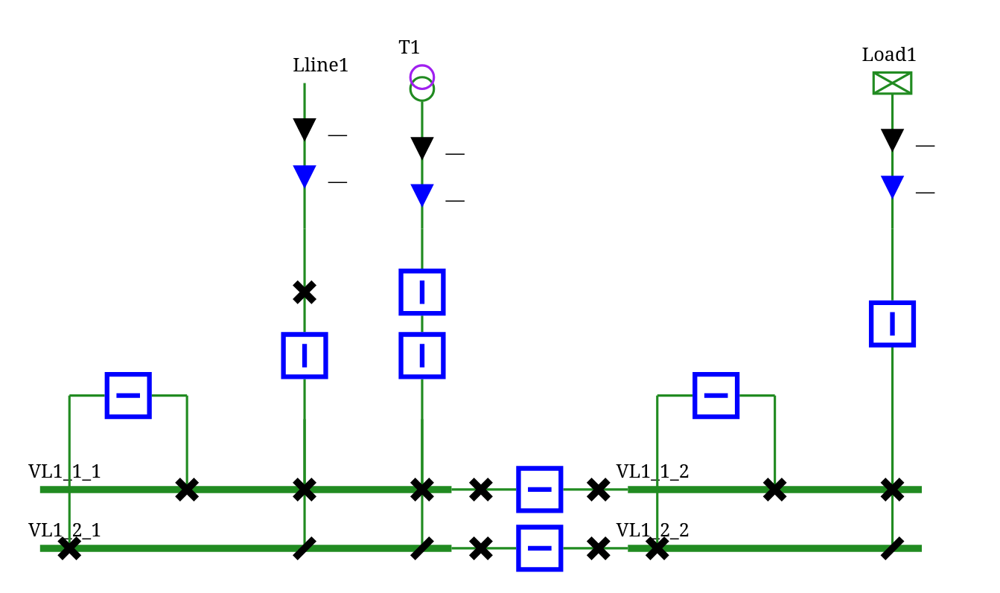
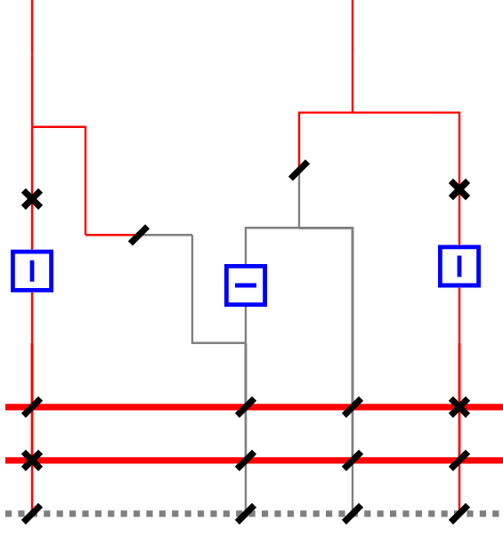

# Asset Topology

The Asset Topology is a central object for the Topology optimizer. It holds the topological information mapped from the node-breaker to the bus-branch model and back, enabling translation of topological actions between models using real switches.

Asset Topology is essential when stations do not allow free assignment of lines to busbars. It helps track valid assignments and ensures correct topology application.

## Class Structure

- [`Strategy`][toop_engine_interfaces.asset_topology.Strategy]  
  Collection of time steps, each represented by a [`Topology`][toop_engine_interfaces.asset_topology.Topology].

- [`Topology`][toop_engine_interfaces.asset_topology.Topology]  
  Stores lean [`RawStation`][toop_engine_interfaces.asset_topology.RawStation] records in `raw_stations`, topology-owned canonical assets in `assets`, and optional [`AssetSetpoint`][toop_engine_interfaces.asset_topology.AssetSetpoint] objects. Rich [`MaterializedStation`][toop_engine_interfaces.asset_topology.MaterializedStation] objects are reconstructed with [`Topology.materialize_stations()`][toop_engine_interfaces.asset_topology.Topology.materialize_stations].

- [`MaterializedStation`][toop_engine_interfaces.asset_topology.MaterializedStation]  
  Contains lists of [`Busbar`][toop_engine_interfaces.asset_topology.Busbar], [`BusbarCoupler`][toop_engine_interfaces.asset_topology.BusbarCoupler], and [`SwitchableAsset`][toop_engine_interfaces.asset_topology.SwitchableAsset].  
  Includes `asset_switching_table`, the current switch connection layout and `asset_connectivity`, all possible selections.
  The `grid_model_id` refers to the bus-branch bus id of the splitable station view, not to the full voltage level id.

- [`RawStation`][toop_engine_interfaces.asset_topology.RawStation]
  Stores the lean station representation used inside [`Topology`][toop_engine_interfaces.asset_topology.Topology].
  Instead of embedded asset payloads it stores aligned station-local arrays `asset_ids`, `asset_branch_ends`, and `asset_bay_ids`.

- [`Busbar`][toop_engine_interfaces.asset_topology.Busbar]  
  Represents a single busbar in a station.

- [`BusbarCoupler`][toop_engine_interfaces.asset_topology.BusbarCoupler]  
  Represents a coupler connecting two [`Busbar`][toop_engine_interfaces.asset_topology.Busbar].
  Note: the current implementation only supports a busbar connection between two busbars. It is planned to add an asset bay for both connection sides.

- [`SwitchableAsset`][toop_engine_interfaces.asset_topology.SwitchableAsset]  
  Represents an asset (line, transformer, generator, etc.) that can be switched. You may leave out non-switchable assets or assign them to a single busbar to have a complete representation of the physical [`Station`][toop_engine_interfaces.asset_topology.Station].

- [`AssetBay`][toop_engine_interfaces.asset_topology.AssetBay]  
  Describes the physical connection (switches) between an asset and busbars. It may contain breaker and disconnector switches.

  The AssetBay class currently supports a bay setup with a Disconnector on [`SwitchableAsset`][toop_engine_interfaces.asset_topology.SwitchableAsset] - Breaker - multiple Disconnectors on [`Busbar`][toop_engine_interfaces.asset_topology.Busbar].

  - The Disconnector on the line side (example Line1) is supported, as this is commonly found in CGMES data, but is not further used in the current implementation.

  - The Breaker of a branch is expected to be the one that connects and disconnects a line. Setups like T1 should have a selection process to decide which breaker will be written into the AssetBay class.

  - The Disconnectors on [`Busbar`][toop_engine_interfaces.asset_topology.Busbar] are selector switches, where only one of them should be closed at any time. Any preprocessing should find double connections, as this 
  will break the later assumption that a [`Busbar`][toop_engine_interfaces.asset_topology.Busbar] split can be performed by opening the [`BusbarCoupler`][toop_engine_interfaces.asset_topology.BusbarCoupler].
  
  {width=50%}

  Note: An AssetBay expects that one Asset has its own bay. Combinations where two assets use shared switches are not supported.
    
    {width=50%}
    
    *Example: AssetBay configuration with two assets sharing switches (not supported).*

- [`AssetSetpoint`][toop_engine_interfaces.asset_topology.AssetSetpoint]  
  Represents an asset with a setpoint (e.g., PST or HVDC).

- [`RealizedStation`][toop_engine_interfaces.asset_topology.RealizedStation]  
  Contains a station and the changes made to it.

- [`RealizedTopology`][toop_engine_interfaces.asset_topology.RealizedTopology]  
  Contains a topology and the changes made to it.

---

## API Reference

See the [`Asset Topology Reference`][toop_engine_interfaces.asset_topology] for full class and method documentation.

## How to use / Implementation

## Station Identity And Asset Scope

The intended station contract is bus-view based:

- `MaterializedStation.grid_model_id` and `RawStation.grid_model_id` identify the bus-branch bus id of the splitable station view.
- The station busbars belong to that bus view and therefore must carry matching `bus_branch_bus_id` values.
- The station-local asset arrays and switching tables describe which assets are visible in that station view and how they attach locally.

The current importer implementations are not fully uniform yet:

- The bus-breaker powsybl helper narrows busbars and assets to the selected `bus_id` before building the station view.
- The node-breaker powsybl importer currently assigns a bus-specific `MaterializedStation.grid_model_id` but still derives the asset list from the full substation graph. This is broader than the intended "single bus-branch bus" scope and should be treated as current implementation behavior, not as the desired long-term contract.
To populate Asset Topology data from grid models, use the [`Network Graph module`][toop_engine_importer.network_graph].  

A Pandapower to Asset Topology implementation is found in the importer: [`get_list_of_stations_ids`][toop_engine_importer.pandapower_import.asset_topology.get_list_of_stations_ids]

Note: the Pandapower version does not currently use the Network Graph module.

A PyPowSyBl to Asset Topology implementation is found in the importer Network Graph module: [`get_topology`][toop_engine_importer.network_graph.powsybl_station_to_graph]
