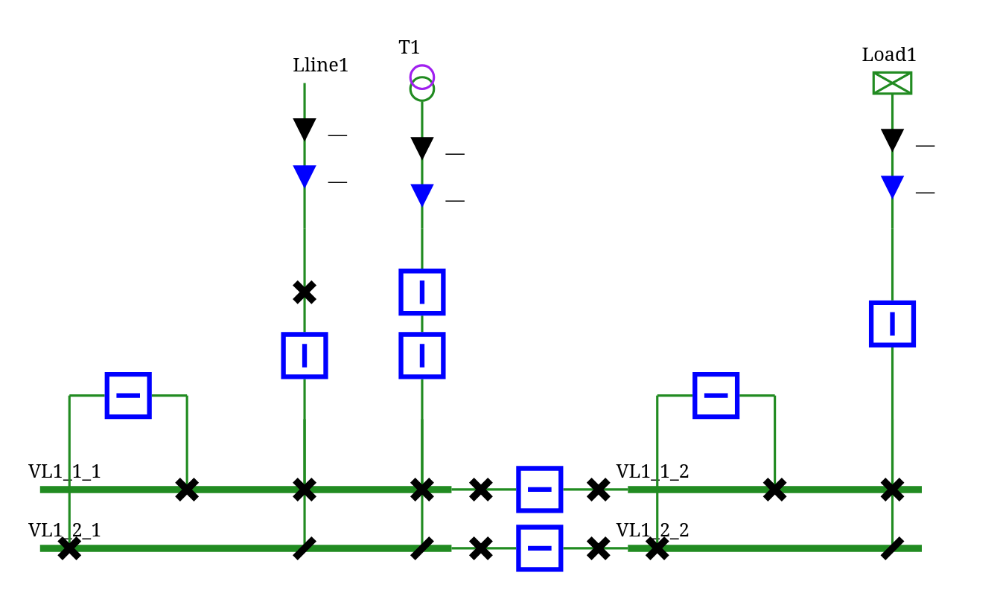
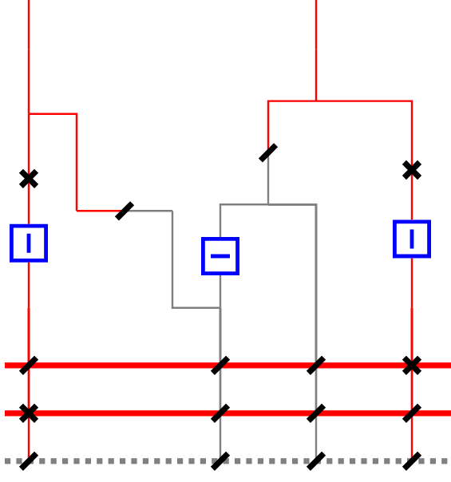

# Asset Topology

The Asset Topology is a central object for the Topology optimizer. It holds the topological information mapped from the node-breaker to the bus-branch model and back, enabling translation of topological actions between models using real switches.

Asset Topology is essential when bus groups do not allow free assignment of lines to busbars. It helps track valid assignments and ensures correct topology application.

## Class Structure

- [`MasterAssetTopology`][toop_engine_interfaces.asset_topology.MasterAssetTopology]  
  Stores the master bus-group structure used across import, preprocess, action storage, and postprocess. It contains [`MasterBusGroup`][toop_engine_interfaces.asset_topology.MasterBusGroup] records with topology-owned busbars, couplers, branch assets, injection assets, and asset bays, but no runtime switch state.

- [`RuntimeAssetTopology`][toop_engine_interfaces.asset_topology.RuntimeAssetTopology]
  Groups the runtime [`RuntimeBusGroup`][toop_engine_interfaces.asset_topology.RuntimeBusGroup] snapshots for one topology view. Productive code often works directly on the pair `MasterAssetTopology + list[RuntimeBusGroup]`.

- [`MasterBusGroup`][toop_engine_interfaces.asset_topology.MasterBusGroup]
  Represents the master bus-group view. Its `bus_group_id` is the stable bus-group identity and is unique within a topology. Structural split groups use deterministic suffixes such as `_a`, `_b`, `_c`. A bus group is a group of busbars that are in some way connected by disconnectors or breakers, even if they are open

- [`RuntimeBusGroup`][toop_engine_interfaces.asset_topology.RuntimeBusGroup]  
  Contains lists of [`Busbar`][toop_engine_interfaces.asset_topology.Busbar], [`BusbarCoupler`][toop_engine_interfaces.asset_topology.BusbarCoupler], and [`SwitchableAsset`][toop_engine_interfaces.asset_topology.SwitchableAsset].  
  Includes `branch_switching_table` and `injection_switching_table` for the current switch connection layout, plus `branch_connectivity` and `injection_connectivity` for physically allowed selections.
  The runtime bus group keeps the canonical `bus_group_id` and may additionally expose active `bus_branch_bus_ids` that identify the currently energized bus-branch buses belonging to that view.

- [`RuntimeAssetConnection`][toop_engine_interfaces.asset_topology.RuntimeAssetConnection]
  Aligns one runtime asset payload and optional [`AssetBay`][toop_engine_interfaces.asset_topology.AssetBay] with one switching-table column inside a [`RuntimeBusGroup`][toop_engine_interfaces.asset_topology.RuntimeBusGroup].

- [`Busbar`][toop_engine_interfaces.asset_topology.Busbar]  
  Represents a single busbar in a bus group.

- [`BusbarCoupler`][toop_engine_interfaces.asset_topology.BusbarCoupler]  
  Represents a coupler connecting two [`Busbar`][toop_engine_interfaces.asset_topology.Busbar].
  Note: the current implementation only supports a busbar connection between two busbars. It is planned to add an asset bay for both connection sides.

- [`SwitchableAsset`][toop_engine_interfaces.asset_topology.SwitchableAsset]  
  Represents an asset (line, transformer, generator, etc.) that can be switched. You may leave out non-switchable assets or assign them to a single busbar to have a complete representation of the physical [`RuntimeBusGroup`][toop_engine_interfaces.asset_topology.RuntimeBusGroup].

- [`AssetBay`][toop_engine_interfaces.asset_topology.AssetBay]  
  Describes the physical connection (switches) between an asset and busbars. It may contain breaker and disconnector switches.

  The AssetBay class currently supports a bay setup with a Disconnector on [`SwitchableAsset`][toop_engine_interfaces.asset_topology.SwitchableAsset] - Breaker - multiple Disconnectors on [`Busbar`][toop_engine_interfaces.asset_topology.Busbar].

  Its switch identifiers are exposed as `asset_disconnector_grid_model_id`, `breaker_grid_model_id`, and `busbar_disconnector_grid_model_id` for the asset disconnector, breaker, and busbar disconnectors respectively.

  - The Disconnector on the line side (example Line1) is supported, as this is commonly found in CGMES data, but is not further used in the current implementation.

  - The Breaker of a branch is expected to be the one that connects and disconnects a line. Setups like T1 should have a selection process to decide which breaker will be written into the AssetBay class.

  - The Disconnectors on [`Busbar`][toop_engine_interfaces.asset_topology.Busbar] are selector switches, where only one of them should be closed at any time. Any preprocessing should find double connections, as this
  will break the later assumption that a [`Busbar`][toop_engine_interfaces.asset_topology.Busbar] split can be performed by opening the [`BusbarCoupler`][toop_engine_interfaces.asset_topology.BusbarCoupler].
  
  {width=50%}

  Note: An AssetBay expects that one Asset has its own bay. Combinations where two assets use shared switches are not supported.
    
    {width=50%}
    
    *Example: AssetBay configuration with two assets sharing switches (not supported).*

- [`AssetSetpoint`][toop_engine_interfaces.asset_topology.AssetSetpoint]  
  Represents an asset with a setpoint (e.g., PST or HVDC).

- [`AppliedStation`][toop_engine_interfaces.asset_topology.AppliedStation]
  Deprecated compatibility wrapper around one applied runtime bus group and its diff.

- [`RealizedTopology`][toop_engine_interfaces.asset_topology.RealizedTopology]  
  Deprecated compatibility wrapper that combines runtime bus groups with diff information for older postprocessing paths.

---

## API Reference

See the [`Asset Topology Reference`][toop_engine_interfaces.asset_topology] for full class and method documentation.

## How to use / Implementation

## Bus-Group Identity And Asset Scope

The current bus-group contract separates master structure from runtime state:

- `MasterBusGroup.bus_group_id` is the master bus-group identity.
- `RuntimeBusGroup.bus_group_id` refers to the same canonical bus group and carries the runtime switch state for that view.
- `RuntimeBusGroup.bus_branch_bus_ids` contains the active bus-branch bus ids currently materialized for that bus group.
- Bus-group-local asset arrays and switching tables describe the runtime-local assets visible in that view and how they attach locally.

Master grouping is structural:

- Structural bus groups are derived independently of the current open or closed switch state.
- Open busbar couplers therefore stay inside the same canonical `bus_group_id` when they are structurally part of the same bus group.
- If one physical substation contains multiple structural groups, the importer assigns deterministic suffix ids such as `bus_group_a`, `bus_group_b`, `bus_group_c`.

Runtime grouping is electrical:

- Runtime bus-group materialization maps the master bus group to the currently energized bus-branch buses.
- A runtime bus-group may expose fewer active bus ids than its canonical structure if parts of the group are disconnected.
- Preprocess and action generation must therefore distinguish between canonical grouping and runtime connectivity instead of deriving identity from legacy bus-group ids.

The current importer implementations are not fully uniform yet:

- The bus-breaker powsybl helper narrows busbars and assets to the selected runtime bus view before building the bus-group snapshot.
- Node-breaker and pandapower importers both build canonical `bus_group_id` values first and then derive runtime bus-group views from the current network state.

For backend APIs, the intended split is:

- `get_master_data_asset_topology(...)` returns the master structural bus-group data.
- `get_runtime_asset_topology(...)` returns the runtime materialized bus-group snapshots aligned to that canonical structure.

To populate Asset Topology data from grid models, use the [`Network Graph module`][toop_engine_grid_helpers.network_graph].  

A Pandapower to Asset Topology implementation is found in the grid helpers: [`get_master_asset_topology_from_network`][toop_engine_grid_helpers.pandapower.asset_topology.get_master_asset_topology_from_network]

Note: the Pandapower version does not currently use the Network Graph module.

A PyPowSyBl to Asset Topology implementation is found in the grid helpers Network Graph module: [`get_topology`][toop_engine_grid_helpers.powsybl.powsybl_station_to_graph]
