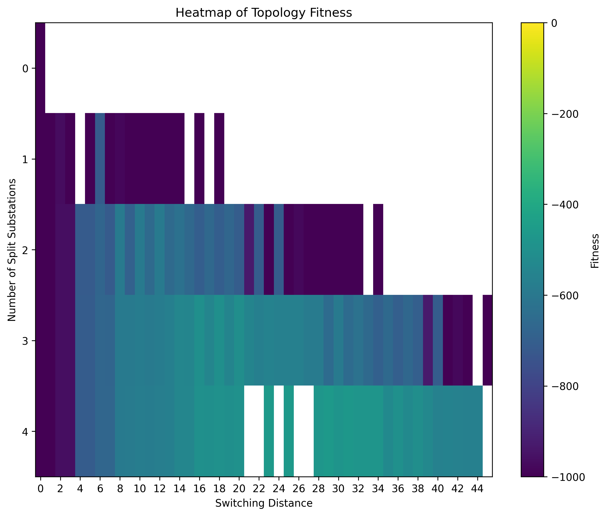
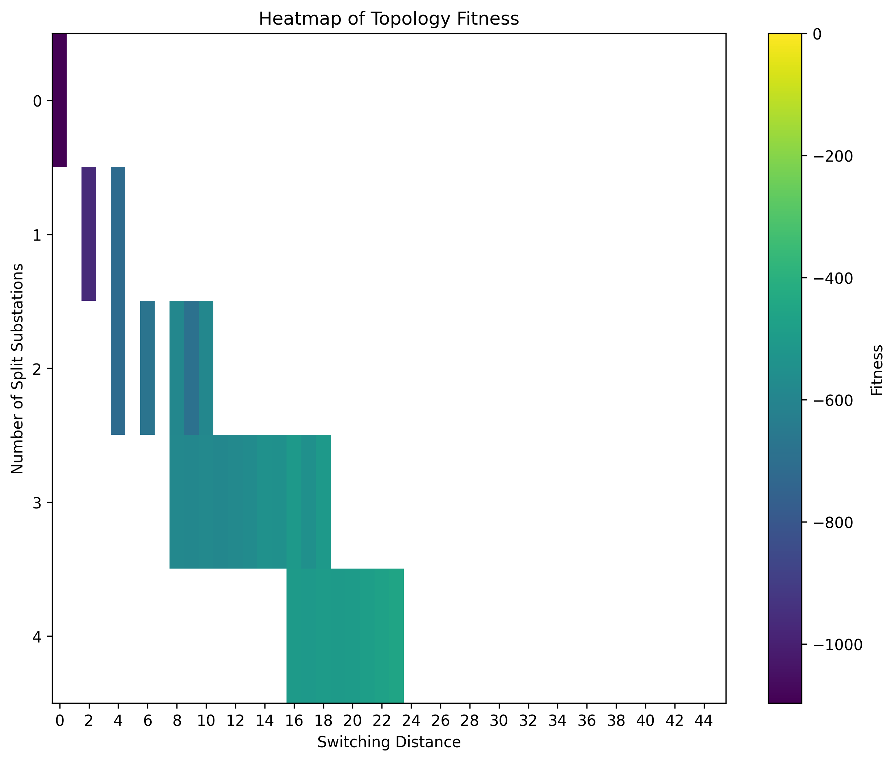
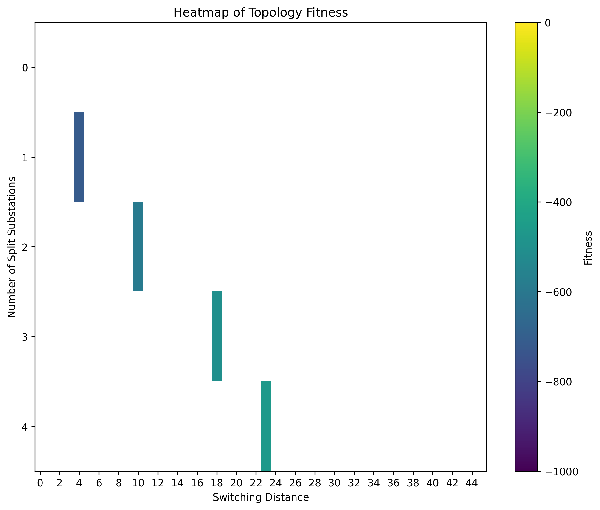
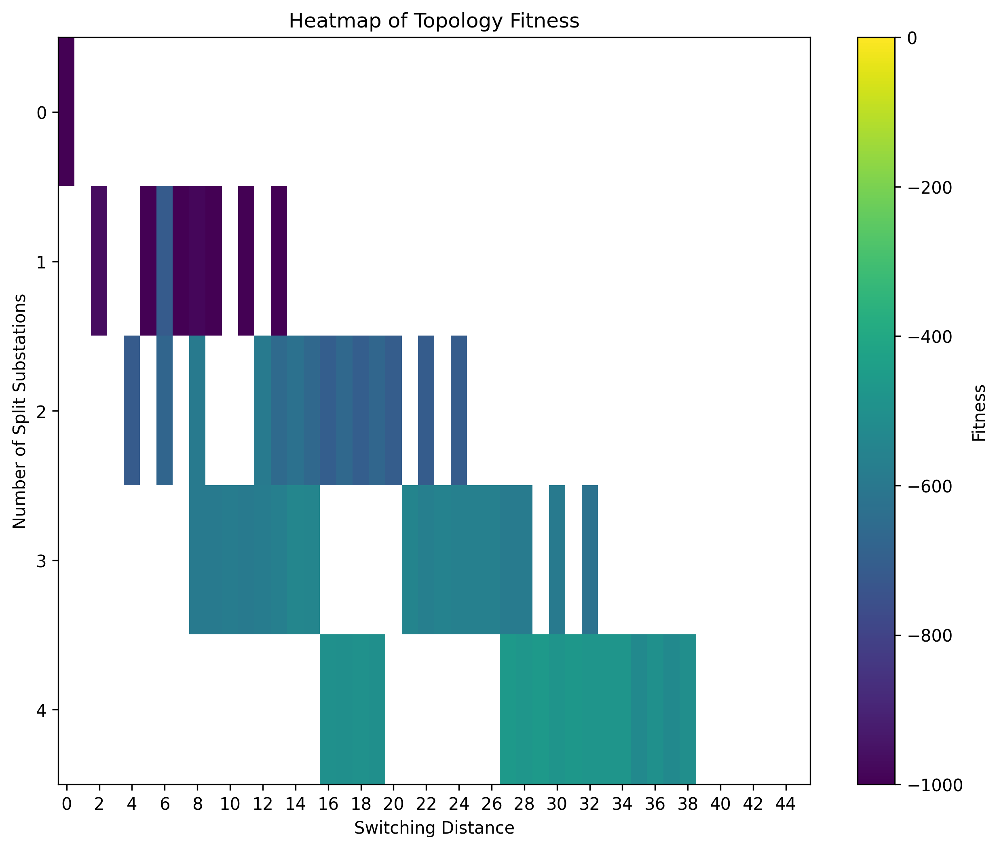
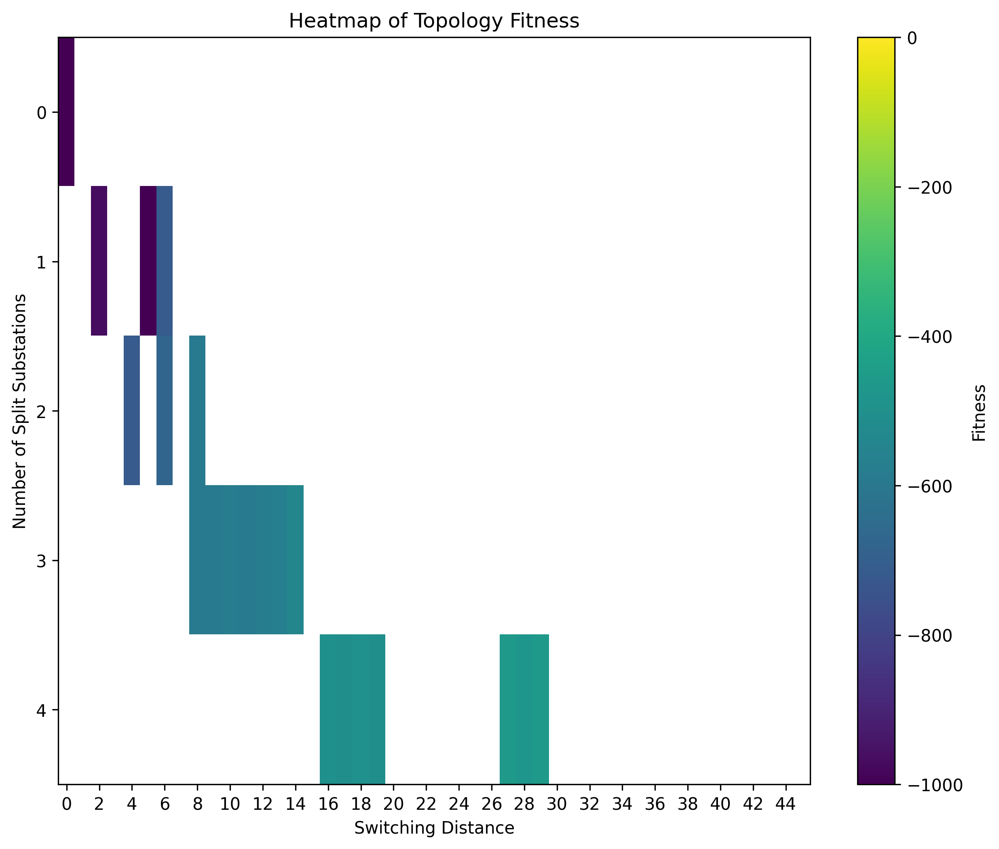

# Selection Strategy

given an example repertoire:

{width=50%}

We Apply different filter to select a good candidates.
The filter "median_filter" and "dominator_filter" and "discriminator_filter" are used.

The median filter is used to remove 50% of the topologies, that are below the median value, given a target metric.
The target metric is per default "split_subs", leading to a filtering per discrete split_subs. E.g. 50% of topologies from split_subs = 1 are filtered.

Applied to the example repertoire:

{width=50%}

The dominator_filter is used to find the best fitness within a target and observation metric.
The target metric is used to fix the discrete value for which the dominance is checked.
The fitness column is used to determine the fitness of the rows.
Each observed metric is checked against the minimum fitness of all discrete target values.
Applied to the example repertoire:

{width=50%}

Has a topology been evaluated, we want to get different topologies evaluated. The discriminator_filter is used to ignore similar topologies.


Applied to the example repertoire:
```python
test_discriminator = pd.DataFrame({
    "split_subs": [1, 4],
    "switching_distance": [4, 24],
    "fitness": [-713, -700]
})
```

{width=50%}


# Selection loop

First the median filter is applied followed by the dominator filter. What is left are the topologies the AC optimizer can now randomly evaluate a topology.

{width=50%}

Now a random topology is selected to evaluate.
Lets assume all the best topologies, furthest to the right in regard of switching distance, have been evaluated. Shown in this plot are the topologies that are assumed to be evaluated up to now:
{width=50%}

Now these previously evaluated topologies get discriminated until the fitness changes substantially.
Applying the discrimination and median filter.

{width=50%}


Now we apply again the domination filter after the discrimination and median filter have been applied.
We now get a new pool that the optimizer can pick a topology to evaluate. We note: more topologies with a higher switching distance are now available for evaluation. We have first prioritized the lower fitness and are now moving towards the higher fitness.

{width=50%}
