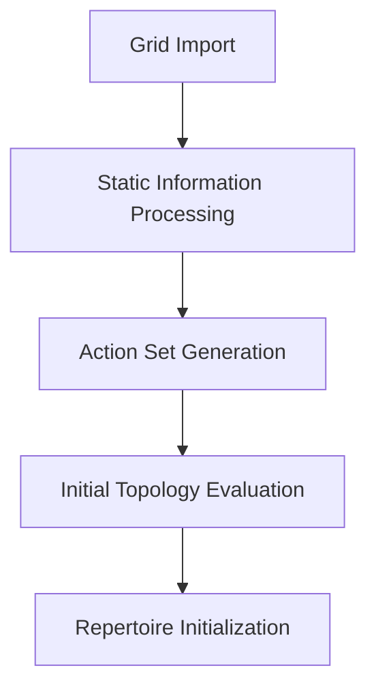
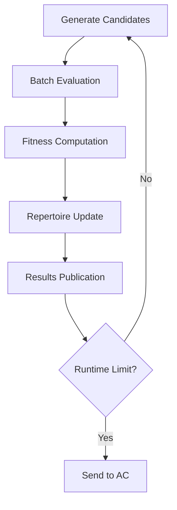
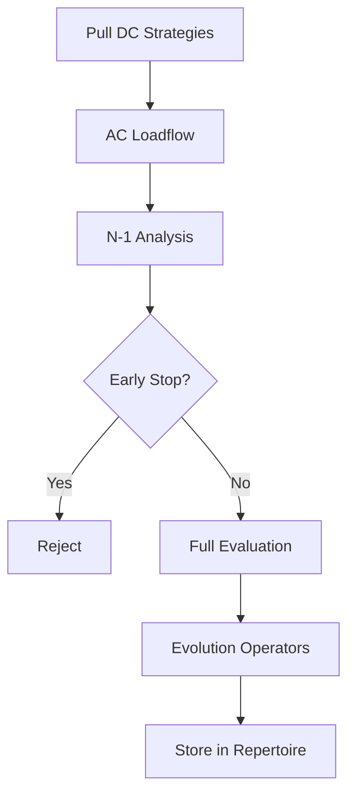

# Under the Hood: Optimization Workflow

!!! Work-in-progress

    We work on a deeper explanation of the underlying genetic algorithm.
    Thank you for your patience.   

## 1. Initialization Phase

1. **Grid preprocessing** using the importer package to create [`StaticInformation`](../dc_solver/preprocessing.md) objects
2. **Action enumeration** generating feasible substation switching combinations
3. **Initial evaluation** establishing baseline metrics for the unsplit grid topology

## 2. DC Optimization Loop

The DC stage uses a quality-diversity approach:

- **Population diversity**: Maintained across descriptor dimensions (splits, switching distance, disconnections)
- **Parallel evaluation**: GPU-accelerated batch processing of topology candidates
- **Elite preservation**: Best solutions preserved in each repertoire cell
- **Continuous publication**: Promising topologies sent to AC stage via Kafka messaging

## 3. AC Validation and Refinement

The AC stage provides high-fidelity validation:

- **Strategy pulling**: Intelligent selection from DC repertoire using [filtering strategies](ac/select_strategy.md)
- **AC validation**: Full power flow with reactive power and voltage constraints
- **[Early stopping](ac/early_stopping.md)**: Efficient rejection based on worst-case N-1 comparison
- **Local search**: Fine-tuning through reconnection and coupler closing operations

## 4. Communication Architecture

The optimizers use **Apache Kafka** for asynchronous, scalable communication:

- **Commands topic**: Optimization start/stop commands with grid file references
- **Results topic**: Topology candidates with metrics and loadflow references  
- **Heartbeats topic**: Status monitoring and performance statistics
